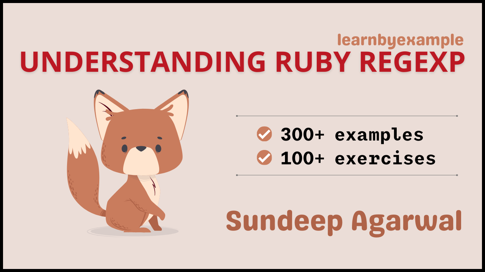

# Understanding Ruby Regexp

Learn Ruby Regular Expressions step-by-step from beginner to advanced levels with hundreds of examples and exercises. Visit https://youtu.be/QNsCzVeZH78 for a short video about the book.

The book also includes exercises to test your understanding, which are presented together as a single file in this repo — [Exercises.md](./exercises/Exercises.md).

For solutions to the exercises, see [Exercise_solutions.md](./exercises/Exercise_solutions.md).

See [Version_changes.md](./Version_changes.md) to keep track of changes made to the book.

 

# E-book

* You can download the pdf/epub versions of the book for free using the below links (you can also pay if you wish):
    * https://learnbyexample.gumroad.com/l/rubyregexp
    * https://leanpub.com/rubyregexp
* You can also get the book as part of these bundles:
    * **All books bundle** bundle from https://learnbyexample.gumroad.com/l/all-books
        * Includes all my programming books
    * **Awesome Regex** bundle from https://learnbyexample.gumroad.com/l/regex or https://leanpub.com/b/regex
    * **Ruby text processing** bundle from https://learnbyexample.gumroad.com/l/ruby-textprocessing or https://leanpub.com/b/ruby-textprocessing
* See https://learnbyexample.github.io/books/ for a list of other books

For a preview of the book, see [sample chapters](./sample_chapters/ruby_regexp_sample.pdf).

The book can also be [viewed as a single markdown file in this repo](./ruby_regexp.md). See my blogpost on [generating pdfs from markdown using pandoc](https://learnbyexample.github.io/customizing-pandoc/) if you are interested in the ebook creation process.

For the web version of the book, visit https://learnbyexample.github.io/Ruby_Regexp/

 

# Feedback

⚠️ ⚠️ Please DO NOT submit pull requests. Main reason being any modification requires changes in multiple places.

I would highly appreciate it if you'd let me know how you felt about this book. It could be anything from a simple thank you, pointing out a typo, mistakes in code snippets, which aspects of the book worked for you (or didn't!) and so on. Reader feedback is essential and especially so for self-published authors.

You can reach me via:

* Issue Manager: [https://github.com/learnbyexample/Ruby_Regexp/issues](https://github.com/learnbyexample/Ruby_Regexp/issues)
* E-mail: `echo 'bGVhcm5ieWV4YW1wbGUubmV0QGdtYWlsLmNvbQo=' | base64 --decode`
* Twitter: [https://twitter.com/learn_byexample](https://twitter.com/learn_byexample)

 

# Table of Contents

1. Preface
2. Why is it needed?
3. Regexp introduction
4. Anchors
5. Alternation and Grouping
6. Escaping metacharacters
7. Dot metacharacter and Quantifiers
8. Interlude: Tools for debugging and visualization
9. Working with matched portions
10. Character class
11. Groupings and backreferences
12. Interlude: Common tasks
13. Lookarounds
14. Modifiers
15. Unicode
16. Further Reading

 

# Acknowledgements

* [ruby-lang documentation](https://www.ruby-lang.org/en/documentation/) — manuals and tutorials
* [/r/ruby/](https://old.reddit.com/r/ruby/) and [/r/regex/](https://old.reddit.com/r/regex/) — helpful forum for beginners and experienced programmers alike
* [stackoverflow](https://stackoverflow.com/) — for getting answers to pertinent questions on Ruby and regular expressions
* [tex.stackexchange](https://tex.stackexchange.com/) — for help on [pandoc](https://github.com/jgm/pandoc/) and `tex` related questions
* [canva](https://www.canva.com/) — cover image
* [Warning](https://commons.wikimedia.org/wiki/File:Warning_icon.svg) and [Info](https://commons.wikimedia.org/wiki/File:Info_icon_002.svg) icons by [Amada44](https://commons.wikimedia.org/wiki/User:Amada44) under public domain
* [oxipng](https://github.com/shssoichiro/oxipng), [pngquant](https://pngquant.org/) and [svgcleaner](https://github.com/RazrFalcon/svgcleaner) — optimizing images
* [gmovchan](https://github.com/gmovchan) for spotting a typo
* **KOTP** for spotting grammatical mistakes
* [mdBook](https://github.com/rust-lang/mdBook) — for web version of the book
    * [mdBook-pagetoc](https://github.com/JorelAli/mdBook-pagetoc) — for adding table of contents for each chapter
    * [minify-html](https://github.com/wilsonzlin/minify-html) — for minifying html files

Special thanks to Allen Downey, an attempt at translating his book [Think Python](https://greenteapress.com/wp/think-python-2e/) to [Think Ruby](https://github.com/learnbyexample/ThinkRubyBuild) gave me the confidence to publish my own book.

 

# License

The book is licensed under a [Creative Commons Attribution-NonCommercial-ShareAlike 4.0 International License](https://creativecommons.org/licenses/by-nc-sa/4.0/).

The code snippets are licensed under MIT, see [LICENSE](./LICENSE) file.

